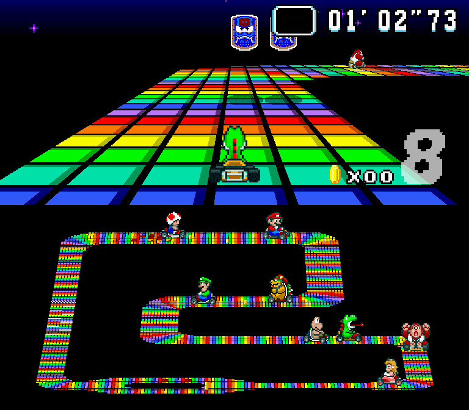
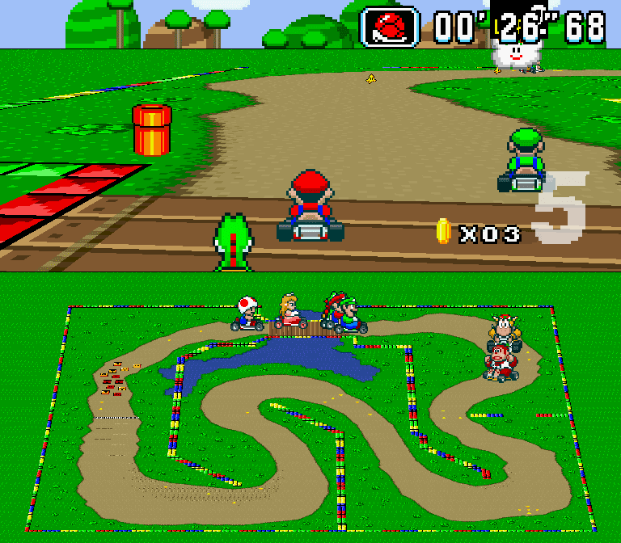
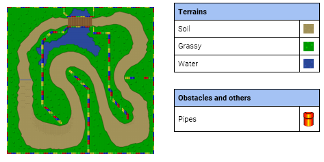
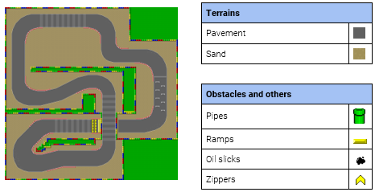
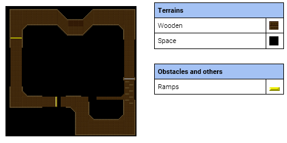
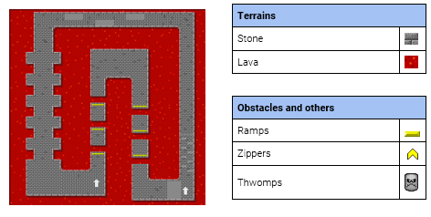
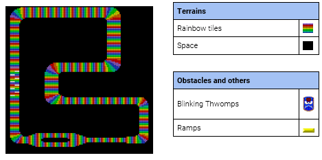

<div style="margin-right: 15px;"></div>

# Süper Mario Kart

   * [_Download and play_](#1-game-download) / [_Build it yourself_](#2-building-süper-mario-kart) / [_Create your own circuits!_](#3-creating-new-circuits)

**Authors:** [Diego Royo](https://github.com/diegoroyo), 
[Víctor Martínez](https://github.com/vmbatlle) and 
[Javier Giménez](https://github.com/JaviBite)

Süper Mario Kart is an C++ implementation of Super Mario Kart, a kart racing 
video game developed and published by Nintendo for the Super Nintendo 
Entertainment System in 1992. The purpose of this project is to understand the 
basic components of a real videogame. The authors do not aim at any commercial
profit and release the source code for the general public under [GPLv3 license](./LICENSE).

<table align="center">
  <tr>
    <td>
      
    </td>
    <td>
      
    </td>
  </tr>
  <tr>
    <td>
      
    </td>
    <td>
      
    </td>
  </tr>
</table>

## Available circuits

### Donut Plains 1
<details>
  <summary>See details</summary>
  
  
  
</details>

### Mario Circuit 2
<details>
  <summary>See details</summary>
  
  
  
</details>

### Ghost Valley 1
<details>
  <summary>See details</summary>
  
  
  
</details>

### Bowser Castle 1
<details>
  <summary>See details</summary>
  
  
  
</details>

### Rainbow Road
<details>
  <summary>See details</summary>
  
  
  
</details>

# 1. Game download

Pre-built binaries (Windows-only) of Süper Mario Kart are available for download in any of the following:

* In the [releases page](https://github.com/vmbatlle/super-mario-kart/releases/latest)
* Also, in our [website](https://sites.google.com/view/sper-mario-kart/inicio)
* For macOS/Linux users, check the [building section](#2-building-süper-mario-kart)

# 1.1. Tips for playing
- You can take a look at the controls (and change them as you like!) in the 
  "Controls" section of the Start Menu.

- Each vehicle has different properties. Please note that they also have some
  drawbacks, so choose carefully!

    * Yoshi and Peach: Greater acceleration, to reach its maximum speed earlier.
    * Koopa and Toad: Higher turning speed, to take better turns.
    * Bowser and Donkey Kong: Higher top speed and higher weight to hit other runners.
    * Mario and Luigi: Balanced vehicles, with a mixture of these factors.

- If you start to accelerate when the second traffic light comes on, you will 
  start the race with a little boost of speed. Be careful, because if you 
  accelerate prematurely, your motor may overheat too much and you could be 
  incapacitated for a few seconds.
  
- Getting coins is more important than it seems. Each increases your maximum 
  speed, which makes a difference. There is a limit of 10 coins per player.

- By turning for a while you can drift, allowing you to make sharp turns without
  problem. Using the drift key (`C` by default) you can enter "drift mode" much 
  earlier, giving you more control over your turns. This is especially useful in
  100cc and 150cc modes.

- If you take a very tight curve and think you are turning too much, you can 
  press the skid key (`C` by default) one or many times. The jump causes you to 
  stop turning for a while, allowing you to open up your trajectory a bit 
  before continuing to skid.

- On more complicated circuits, such as Bowser Castle 1 or Rainbow Road, it is a
  good idea to brake in curves. We also have to be careful with some objects,
  like the mushroom, since the speed boost can be difficult to control.

# 2. Building Süper Mario Kart

# 2.1. Prerequisites

We have tested the game in Windows 10 and some Linux distributions. For 
building your own executable file, the following are needed.

## C++11 Compiler

We use MinGW32 (posix) 8.1.0 by [MinGW-W64](http://mingw-w64.org/) for Windows 
and [GCC](https://gcc.gnu.org/) 7.5.0 for Linux.

## Simple and Fast Multimedia Library (SFML)

We use [SFML 2.5.1](https://www.sfml-dev.org/download/sfml/2.5.1/) for graphics
generation and audio playback.

## Open Audio Library (OpenAL)

We use [OpenAl](https://www.openal.org/) as cross-platform API for 3D audio.

# 2.2. Building

Clone the repository:

```bash
git clone https://github.com/vmbatlle/super-mario-kart SMK
```

We provide a `Makefile` to build the source and link needed libraries statically
(Windows only). Please make sure you have installed all required dependencies 
(see [section 2](#2-prerequisites)). Execute:

```bash
cd SMK/src
make -j8 release  # change -j option according to your CPU threads
```

This will create a *bin* folder with compiled files and the executable 
**super_mario_kart** in the parent folder.

# 3. Creating new circuits

Some [utils](./utils) are provided for semi-automatic generation of new circuits.
For this process the following requiremenst are expected:

- Python 3.X interpreter.
- Python libraries: Numpy 1.16.1 and Matplotlib 3.1.3. Other versions may work.
- Assets of the circuit: with and without floor objects.
- **(Optional)** Add new land params to `generate_map.py`. Land types for Donut 
  Plains, Mario Circuit, Ghost Valley, Bowser Castle and Rainbow Road are already
  implemented as invocation flags.
- **(Optional)** Add wall sprites next to the scripts.
- Background and final lap music, if not yet present.
- Edge material, for texture out of circuit bounds.
- Sky back and front assets.

## Steps

1. Prepare plain circuit asset (without floor objects), and execute:

```bash
python ./generate_map.py -f PATH_TO_ASSET -w WALL_TYPE_FILE -t CIRCUIT_TYPE
```

Then, `base.txt` will be generated next to the asset file.

Example:

```bash
python ./generate_map.py \
    -f ../assets/circuit/mario_circuit_2/base.png \
    -w walls.png \
    -t mario_circuit
```

2. Find the circuit asset with floor objects, and proceed:

```bash
python ./generate_floor_objects.py -f PATH_TO_ASSET -o OBJECTS_FILE
```

Then, `objects.txt` will be generated in the same folder.

Example:

```bash
python ./generate_floor_objects.py \
    -f ../assets/circuit/mario_circuit_2/objects.png \
    -o floor_objects.png
```

3. Add the new option to the game menu, at `racemanager.h`:

```c++
CIRCUIT_DISPLAY_NAMES = {"name_of_the_circuit"};
CIRCUIT_ASSET_NAMES = {"path/to/circuit/folder"};
```

Example:
_Note: some aspects of the game (menus, etc.) are made with five circuits in mind (not six), so it's easier to swap your new circuit for an old one._

```c++
constexpr const int NUM_CIRCUITS = 5;

const std::array<std::string, NUM_CIRCUITS> CIRCUIT_DISPLAY_NAMES = {
    "donut plains 1",  "mario circuit 2", "ghost valley 1",
    "bowser castle 1", "rainbow road",
};

const std::array<std::string, NUM_CIRCUITS> CIRCUIT_ASSET_NAMES = {
    "assets/circuit/donut_plains_1", "assets/circuit/mario_circuit_2",
    "assets/circuit/ghost_valley_1", "assets/circuit/bowser_castle_1",
    "assets/circuit/rainbow_road",
};
```

4. Rebuild target (see [section 2](#2-building-süper-mario-kart))

5. First time the new circuit is loaded `gradient.txt` and `position.txt` will
   be generated from the `base.txt` file.

Please, keep the folder tree as follows:

* assets/
    * circuit/
        * *circuit_name/*
            * base.png
            * base.txt
            * edge.png
            * final_lap.ogg
            * gradient.txt
            * music.ogg
            * objects.png
            * objects.txt
            * position.txt
            * sky_back.png
            * sky_front.png
